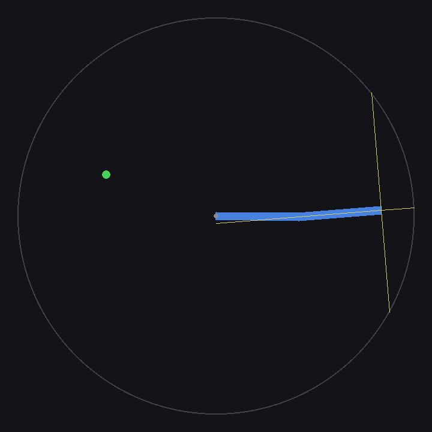
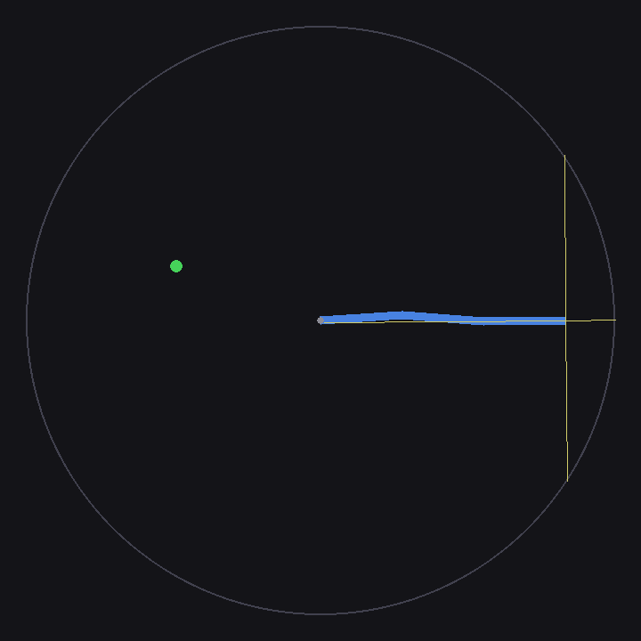
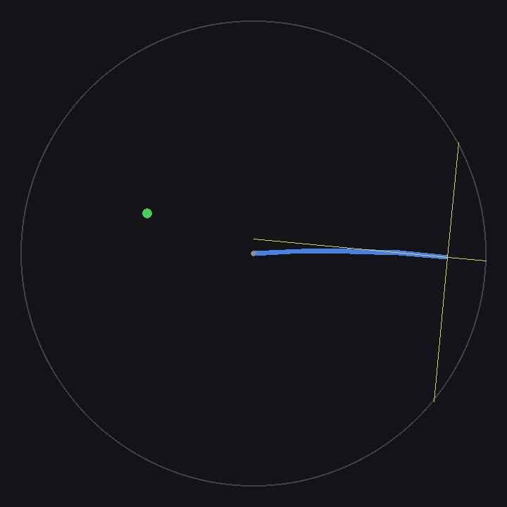
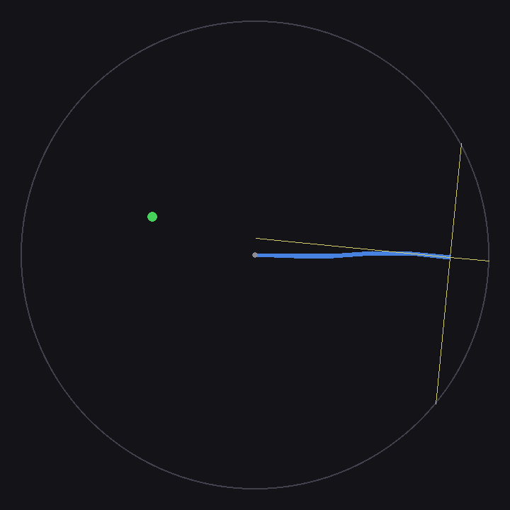
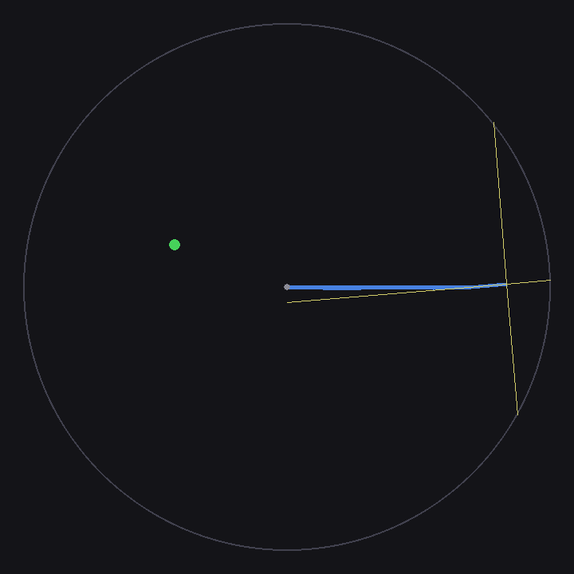
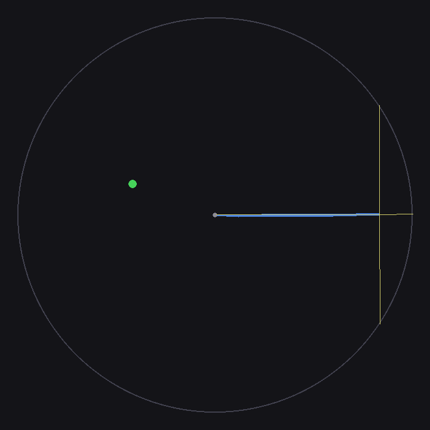
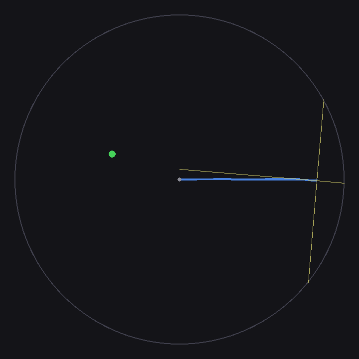
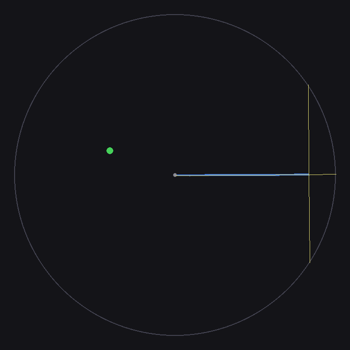

## Creaturenv (Gymnasium + Box2D)

This repository contains two configurable 2D RL environments:

- `SwimmerNavigation-v0`: articulated multi-leg swimmer with tip thrusters, lidar, and obstacle navigation.
- `ChainReacher-v0`: anchored articulated chain that reaches a target with optional obstacles and lidar sensing.

The goal is to support progressively harder environment configurations by varying parameters (for example leg/link count and obstacle density) instead of only switching across unrelated benchmark tasks.

| 2 links | 3 links | 4 links | 5 links |
| --- | --- | --- | --- |
|  |  |  |  |

| 6 links | 7 links | 8 links | 9 links |
| --- | --- | --- | --- |
|  |  |  |  |

## NOTE:

This project was initially generated with AI assistance and then iterated in-editor. Please review behavior, safety constraints, and physics assumptions before using it for research or production work.

## Setup

```bash
python3 -m venv venv
source venv/bin/activate
pip install --upgrade pip
pip install -r requirements/base.txt
```

Optional RL extras:

```bash
pip install -r requirements/rl.txt
```

## Quick Usage Example

### Swimmer

```python
import gymnasium as gym
import envs.swimer  # registers SwimmerNavigation-v0

env = gym.make(
    "SwimmerNavigation-v0",
    leg_spec=[2, 1, 3],
    num_obstacles=4,
    render_mode="human",
)
obs, info = env.reset(seed=0)

for _ in range(200):
    action = env.action_space.sample()
    obs, reward, terminated, truncated, info = env.step(action)
    env.render()
    if terminated or truncated:
        obs, info = env.reset()

env.close()
```

### Reacher

```python
import gymnasium as gym
import envs.chain_reacher  # registers ChainReacher-v0

env = gym.make(
    "ChainReacher-v0",
    n_links=4,
    n_obs=3,
    obstacle_seed=7,
    render_mode="human",
)
obs, info = env.reset(seed=0)

for _ in range(300):
    action = env.action_space.sample()
    obs, reward, terminated, truncated, info = env.step(action)
    env.render()
    if terminated or truncated:
        obs, info = env.reset()

env.close()
```
